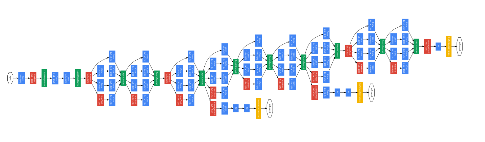
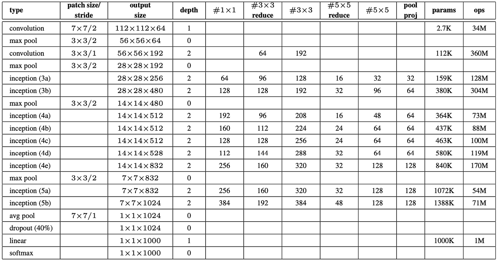

# GoogleNet ( Inception )
Google Net (or Inception V1) was proposed by research at Google (with the collaboration of various universities) in 2014 in the research paper titled “Going Deeper with Convolutions”. This architecture was the winner at the ILSVRC 2014 image classification challenge. It has provided a significant decrease in error rate as compared to previous winners AlexNet (Winner of ILSVRC 2012) and ZF-Net (Winner of ILSVRC 2013) and significantly less error rate than VGG (2014 runner up).

GoogLeNet is a 22 layer deep network that is a variant of inception, the quality of which is assessed in the context of face detection, object detection, and classification.

GoogleNet architecture achieved state-of-the-art performance on the ImageNet dataset, and its use of Inception modules and other efficiency techniques has influenced the design of subsequent CNN architectures.

### GoogleNet parametrs



## Clone recursively
``` shell
git clone https://github.com/yahyoxonqwe/GoogleNet.git
```
## Enter this file
``` shell
cd GoogleNet
```
## Install Virtual environment
``` shell
python -m pip install --user virtualenv
```
## give a name this environment
``` shell
python -m venv your_env
```
## Activate this environment
``` shell
your_env\Scripts\activate.bat
```
## Install requirements
``` shell
pip install -r requirements.txt
```
## Open jupyter notebook
``` shell
jupyter notebook
```

